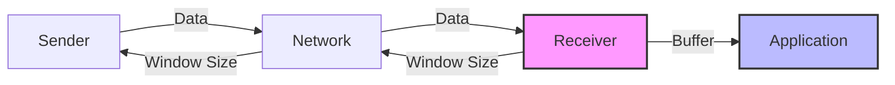
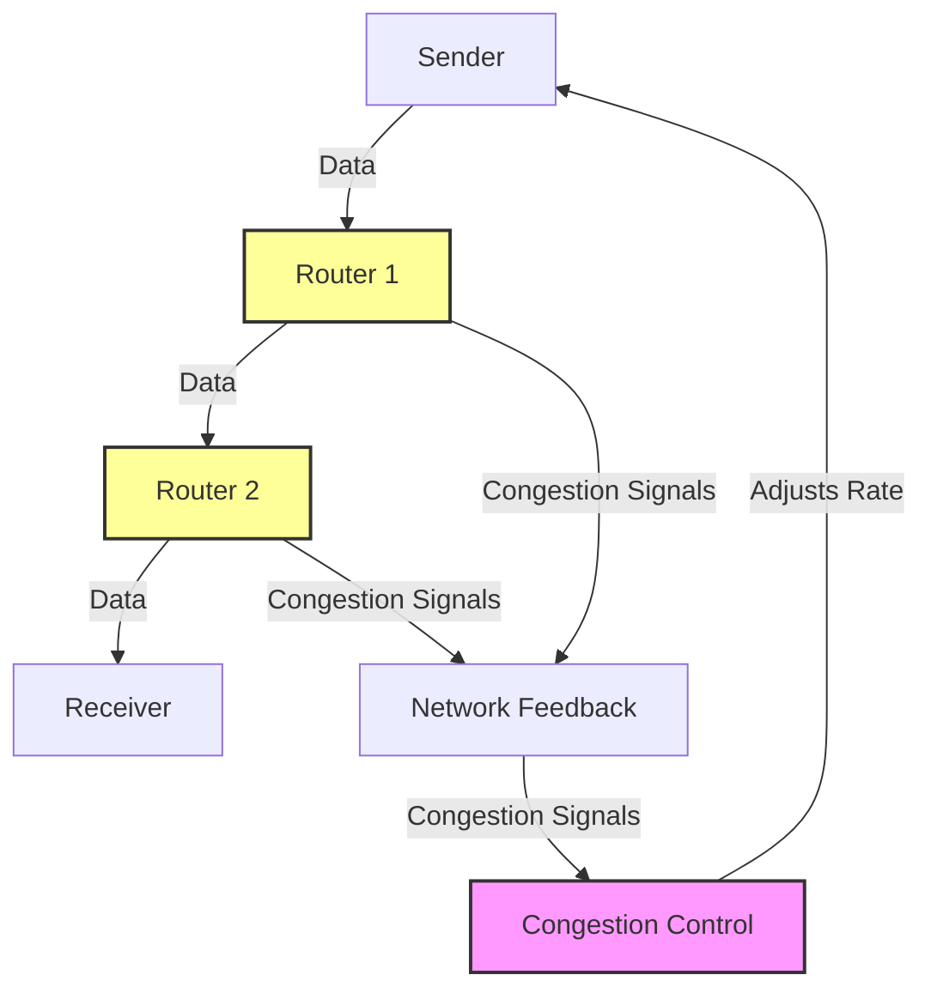
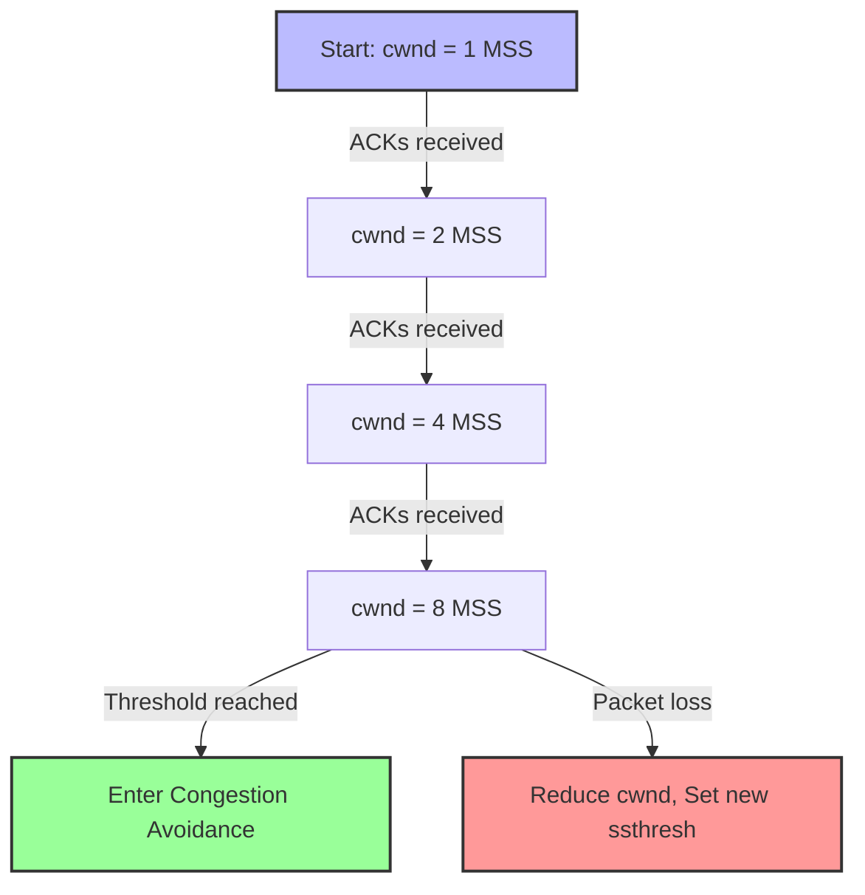
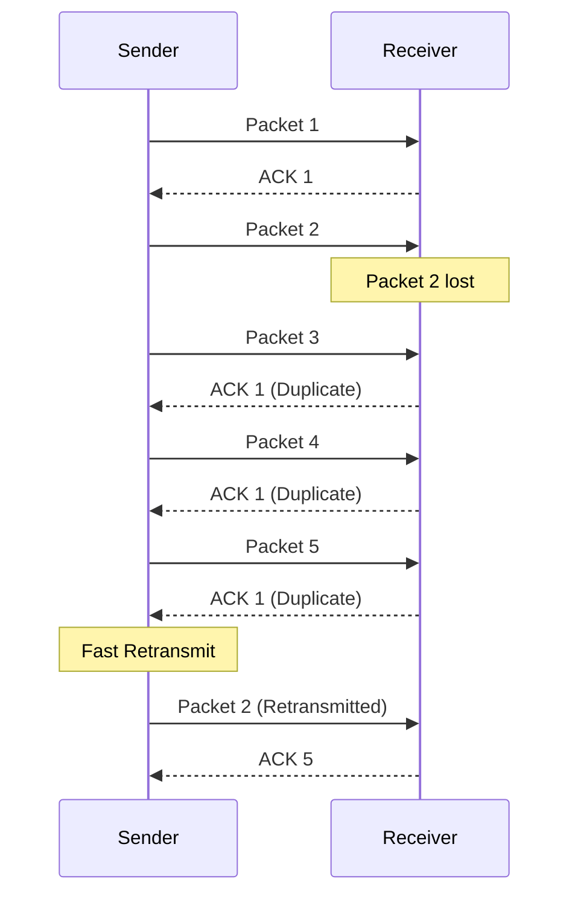
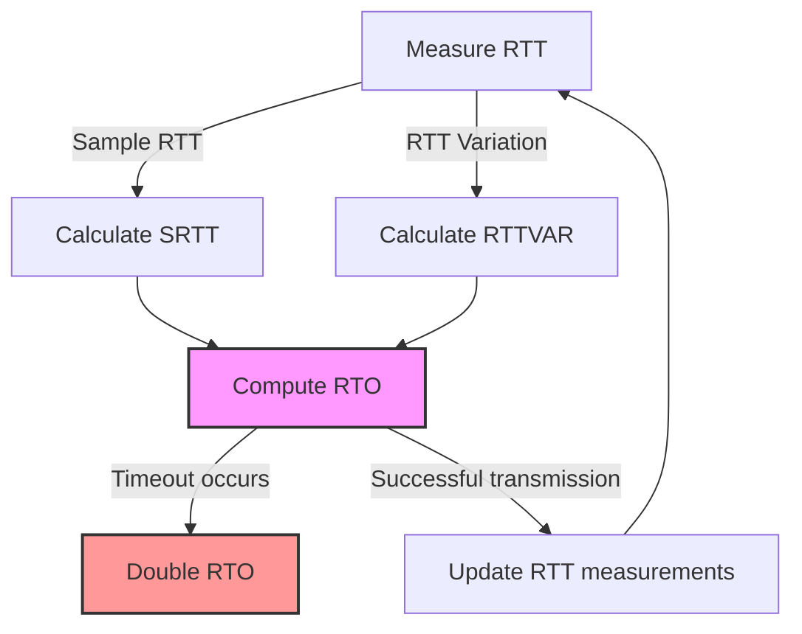

---
# try also 'default' to start simple
theme: default
# random image from a curated Unsplash collection by Anthony
background: https://source.unsplash.com/collection/94734566/1920x1080
# apply any windi css classes to the current slide
class: 'text-center'
# https://sli.dev/custom/highlighters.html
highlighter: shiki
# show line numbers in code blocks
lineNumbers: false
# some information about the slides, markdown enabled
info: |
  ## TCP Flow Control, TCP Congestion Control, and Retransmission
  Presentation slides for Computer Networks.
# persist drawings in exports and build
drawings:
  persist: false
# use UnoCSS
css: unocss
# enable slide transitions
transition: slide-left
# enable wake lock to prevent display from sleeping
wakeLock: "build"
# custom theme colors
themeConfig:
  primary: '#4D7FFF'
  secondary: '#FF7D4D'
  background: '#f8f9fa'
  header: '#2c3e50'
  codeBackground: '#1a1a1a'
  codeColor: '#eee'
---

# TCP Flow Control, TCP Congestion Control, and Retransmission

A brief overview of the TCP mechanisms that ensure reliable data transmission

  
    Press Space for next page <carbon:arrow-right class="inline"/>
  

  <button @click="$slidev.nav.openInEditor()" title="Open in Editor" class="text-xl icon-btn opacity-50 !border-none !hover:text-white">
    <carbon:edit />
  </button>

  Pushpa Kumari 
  Bhagat Phool Singh Mahila Vishwavidyalaya (BPSMV)

<!--
Good morning/afternoon, everyone. My name is Pushpa Kumari, and today, I'll be talking about TCP flow control, TCP congestion control, and retransmission — key mechanisms in ensuring the reliability and efficiency of data transfer in TCP networks.
-->

---

# Introduction to TCP

- **T**ransmission **C**ontrol **P**rotocol
- Connection-oriented, reliable protocol
- Used for applications requiring reliable data transmission:
  - Web browsing
  - File transfers
  - Email
  - Remote login

  

<!--
Let's begin with a brief introduction to TCP. TCP, or Transmission Control Protocol, is a connection-oriented protocol that ensures reliable communication between devices over a network. Unlike UDP, which is connectionless, TCP guarantees data delivery, error checking, and data integrity, making it ideal for applications like web browsing and file transfers.
-->

---

# Importance of Flow Control in TCP

- **Definition**: Mechanism to prevent sender from overwhelming receiver
- **Purpose**: 
  - Manages data transmission rate
  - Prevents buffer overflow at receiver
  - Ensures efficient data processing
- **Key Concept**: Receiver's buffer has limited capacity

<!--
Flow control in TCP ensures that the sender doesn't transmit more data than the receiver can handle. This is achieved by managing the data rate and controlling the amount of data in transit. It's crucial for preventing buffer overflow at the receiver's end, thus avoiding data loss.
-->

---

# How TCP Flow Control Works

- **Sliding Window Mechanism**
- Window size adjusts based on available buffer space
- Sender can only transmit data within the window size
- Receiver advertises window size in ACK packets

  

<!--
TCP uses a sliding window mechanism to manage flow control. The receiver advertises a window size, which indicates the amount of data it can accept. The sender can only send data within this window size. As the receiver processes data, the window size can change, allowing the sender to send more data.
-->

---

# Introduction to TCP Congestion Control

- **Definition**: Mechanism to prevent network congestion
- **Purpose**: 
  - Controls amount of data sent into network
  - Prevents intermediate routers from being overwhelmed
  - Reduces packet loss due to congestion
- **Flow Control vs. Congestion Control**:
  - Flow control: Sender-receiver relationship
  - Congestion control: Sender-network relationship

<!--
Congestion control, on the other hand, aims to prevent congestion in the network. It ensures that the sender doesn't inject too much data into the network, which could overwhelm intermediate routers and cause packet loss. While flow control deals with the sender and receiver, congestion control manages the data rate in the network itself.
-->

---

# Key Mechanisms of TCP Congestion Control

- **Slow Start**:
  - Gradually increases sending rate
  - Starts with small congestion window
  
- **Congestion Avoidance**:
  - Decreases rate when congestion is detected
  - Linear growth of congestion window
  
- **Fast Retransmit and Fast Recovery**:
  - Deals with packet loss efficiently
  - Avoids timeouts when possible

  

<!--
TCP uses several algorithms for congestion control, starting with Slow Start, where the sender begins with a small amount of data and gradually increases the sending rate. When congestion is detected, the algorithm switches to Congestion Avoidance, which prevents further congestion by slowing down the sending rate. Additionally, Fast Retransmit and Fast Recovery allow for quick recovery when packet loss is detected.
-->

---

# TCP Congestion Control - Slow Start

- Sender starts with a small congestion window (cwnd)
  - Typically 1 Maximum Segment Size (MSS)
- Window size grows exponentially
  - For each ACK received, cwnd increases by 1 MSS
- Growth continues until:
  - Threshold (ssthresh) is reached
  - Packet loss occurs
- After threshold, growth becomes linear (Congestion Avoidance)

<!--
In the Slow Start phase, the sender starts with a very small congestion window, typically one Maximum Segment Size (MSS). The window size increases exponentially as the sender successfully receives acknowledgements. However, when the threshold is reached, the window size grows linearly instead.
-->

---

# TCP Congestion Control - Congestion Avoidance

- Activated after Slow Start phase
- Congestion window grows linearly
  - Increases by 1 MSS per round-trip time
- More cautious growth to avoid congestion
- Triggered by:
  - Reaching ssthresh during Slow Start
  - Recovering from packet loss
- If packet loss occurs:
  - Reduce cwnd
  - Set new ssthresh
  - Return to Slow Start or Fast Recovery

  

<!--
Once the threshold is reached, TCP enters the Congestion Avoidance phase, where the congestion window increases linearly. This helps avoid sudden congestion. If packet loss or timeout occurs, TCP reduces the congestion window size and adjusts its behavior to prevent further congestion.
-->

---

# Retransmission in TCP

- **Definition**: Resending of packets that were lost or corrupted
- **Purpose**: Ensures reliable delivery of all data
- **Two Primary Methods**:
  1. **Timeout-based Retransmission**:
     - Sender waits for Retransmission Timeout (RTO)
     - If no ACK received within RTO, packet is retransmitted
  
  2. **Duplicate ACK-based Retransmission**:
     - Triggered by receiving duplicate ACKs
     - Faster than waiting for timeout

<!--
Retransmission is a key feature of TCP that guarantees reliable delivery. When a packet is lost, TCP ensures it is resent. There are two primary methods for retransmission: Timeout-based, where the sender waits for a timeout before retransmitting, and Duplicate Acknowledgement-based, where duplicate ACKs from the receiver indicate packet loss and trigger retransmission.
-->

---

# TCP Retransmission - Fast Retransmit

- **Fast Retransmit**:
  - Triggered by 3 duplicate ACKs
  - Sender immediately retransmits missing segment
  - No need to wait for timeout
  - Improves efficiency and throughput
  
- **Benefits**:
  - Reduces idle time
  - Faster recovery from packet loss
  - Maintains higher throughput

  

<!--
Fast Retransmit is a mechanism that helps speed up retransmission. If the sender receives three duplicate acknowledgements for the same packet, it assumes the packet was lost and immediately retransmits it without waiting for a timeout.
-->

---

# Retransmission Timeout (RTO)

- **RTO Calculation**:
  - Based on Round-Trip Time (RTT)
  - Uses smoothed RTT and RTT variation
  - Formula: RTO = SRTT + 4 × RTTVAR
  
- **Adaptive Mechanism**:
  - Adjusts based on network conditions
  - Increases exponentially after timeout (backoff)
  - Minimum and maximum bounds
  
- **Importance**:
  - Balances quick recovery vs. unnecessary retransmissions
  - Adapts to changing network conditions

<!--
Retransmission Timeout (RTO) is calculated based on the round-trip time (RTT) between the sender and receiver. If an ACK is not received within the RTO period, the sender assumes packet loss and retransmits the data. This timeout period is adaptive and adjusts according to network conditions, improving reliability.
-->

---
layout: center
class: text-center
---

# Conclusion

- **TCP Flow Control**:
  - Prevents sender from overwhelming receiver
  - Uses sliding window mechanism
  
- **TCP Congestion Control**:
  - Prevents network congestion
  - Uses Slow Start, Congestion Avoidance, Fast Recovery
  
- **TCP Retransmission**:
  - Ensures reliable data delivery
  - Uses timeout and duplicate ACK mechanisms
  
- **Together, these mechanisms ensure**:
  - Reliable communication
  - Efficient use of network resources
  - Adaptability to changing network conditions

  
    Thank you for your attention!
  

<!--
To conclude, TCP flow control, congestion control, and retransmission are fundamental mechanisms that ensure reliable communication over a network. Flow control ensures the sender doesn't overwhelm the receiver, while congestion control prevents network congestion. Retransmission guarantees that lost data is recovered. Thank you for your attention, and I am now happy to take any questions.
-->